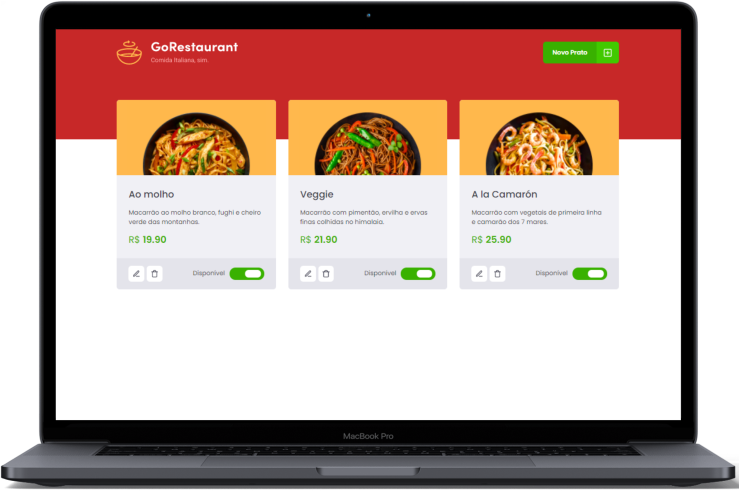

 <p align="center">
    
  </p>


  <p align="center">
    
  </p>

<h3 align="center">
  Foi desenvolvido o front-end de uma aplicação de um restaurante, a GoRestaurant, utilizando uma fake API, criada usando o JSON Server, para simular os dados a serem consumidos e exibir os pratos de comida existentes e permitir a criação de novos pratos e remoção e atualização dos já cadastrados.
</h3>

<p align="center">
  

  

  
</p>

<p align="center">
  <a href="#funcionalidades">Funcionalidades</a>&nbsp;&nbsp;&nbsp;|&nbsp;&nbsp;&nbsp;
  <a href="#heavy_check_mark-configurações-necessárias">Configurações necessárias</a>&nbsp;&nbsp;&nbsp;|&nbsp;&nbsp;&nbsp;
  <a href="#arrow_down_small-clonando-o-repositório">Clonando o repositório</a>&nbsp;&nbsp;&nbsp;|&nbsp;&nbsp;&nbsp;
  <a href="#beginner-iniciando-a-aplicação">Iniciando a aplicação</a>&nbsp;&nbsp;&nbsp;|&nbsp;&nbsp;&nbsp;
  <a href="#wrench-tecnologias--ferramentas--recursos">Tecnologias | Ferramentas | Recursos</a>&nbsp;&nbsp;&nbsp;|&nbsp;&nbsp;&nbsp;
  <a href="#memo-license">Licença</a>
</p>

Durante as aulas do [RocketSeat GoStack Bootcamp](https://rocketseat.com.br/bootcamp) foram aprendidos conteúdos relacionados a React.js junto ao TypeScript. Para treinar o que foi aprendido até o momento foi desenvolvido o front-end de uma aplicação para praticar o conceito de CRUD (Create, Read, Update e Delete).

### Funcionalidades

- Listar os pratos de comida da fake API;
- Adicionar novos pratos de comida;
- Editar pratos de comida já existentes;
- Remover pratos de comida existentes;
- Alterar a disponibilidade dos pratos de comida.

### :heavy_check_mark: Configurações necessárias

Seguem as configurações neessárias para visualizar a aplicação em sua máquina.

-  [Git](https://git-scm.com);
-  [Node](https://nodejs.org/);
-  [Yarn](https://yarnpkg.com/).

### :arrow_down_small: Clonando o repositório
1. Pelo terminal, acesse o diretório em que deseja ter o repositório clonado e execute o comando a seguir.
```bash
# clonando o repositório
git clone https://github.com/belapferreira/go-restaurant-web
```

### :beginner: Iniciando a aplicação
1. Pelo terminal, acesse a pasta do repositório clonado e execute os comandos abaixo.
```bash
# instalando as dependências
yarn install

# iniciando a fake API
yarn json-server server.json -p 3333
```
### :mag: Realizando os testes
1. Foi usado um template que contém testes para orientar o que esperava-se dos blocos de códigos a serem programados;
2. Para verificar se qualquer alteração realizada atende aos requisitos solicitados, acesse o terminal e execute o seguinte comando:
```bash
# testando atendimento aos requisitos
yarn test
```

### :wrench: Tecnologias | Ferramentas | Recursos

Esse projeto foi desenvolvido utilizando os seguintes recursos:

-  [Axios](https://github.com/axios/axios);
-  [Editor Config](https://editorconfig.org/);
-  [Eslint](https://eslint.org/);
-  [Jest](https://jestjs.io/);
-  [Jest Environment JSDom Sixteen](https://github.com/SimenB/jest-environment-jsdom-sixteen);
-  [Json Server](https://github.com/typicode/json-server);
-  [Prettier](https://prettier.io/);
-  [React](https://pt-br.reactjs.org/);
-  [React App Rewired](https://github.com/timarney/react-app-rewired);
-  [React DOM](https://pt-br.reactjs.org/docs/react-dom.html);
-  [React Icons](https://react-icons.github.io/react-icons/);
-  [React Modal](https://github.com/reactjs/react-modal);
-  [React Router Dom](https://reactrouter.com/web/guides/quick-start);
-  [React Scripts](https://github.com/facebook/create-react-app/tree/master/packages/react-scripts);
-  [Styled Components](https://styled-components.com/);
-  [TypeScript](https://www.typescriptlang.org/).
-  [Yup](https://github.com/jquense/yup).

### :memo: License
Esse projeto está sob MIT license. Veja [LICENSE](https://github.com/belapferreira/go-restaurant-web/blob/master/LICENSE) para mais informações.

---

Feito por Bela Ferreira :blue_heart: Contato: https://www.linkedin.com/in/belapferreira :blush:
